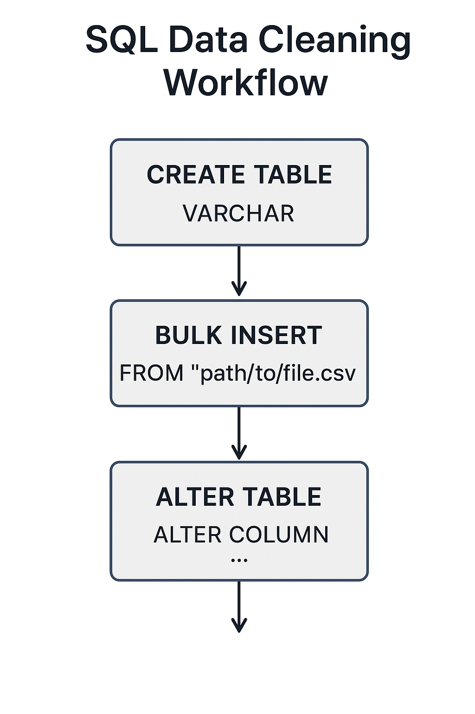

# Bank Customer Churn Prediction

## Overview
This project analyzes customer behavior in banking and predicts churn using Machine Learning techniques. 
The goal is to identify high-risk customers and support business decisions for customer retention.

## Tools & Technologies
- Python (Pandas, NumPy, Scikit-learn)
- SQL
- Power BI
- Git, GitHub

## Folder Structure
/data

/python

/sql

/powerbi

---

## Business Questions
- Which segment has the highest churn?
- What factors influence customer churn?
- Can churn be predicted using machine learning?

## Current Stage
- Project skeleton created
- Folder structure ready

## Next Steps
1. SQL data cleaning
2. Python EDA
3. ML model
4. Power BI dashboard

Status: In progress 🚧
